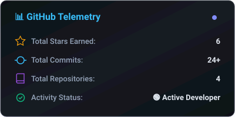

  <!-- Animated Header Banner with Authentic Parabole Typography -->
  

  <!-- Animated Typing Subtitle -->
  

  

    
    
    <a href="https://komarev.com/ghpvc/?username=rushwin209&label=Profile%20Views&color=38bdf8&style=for-the-badge" alt="Profile Views" />
  

---

  

### 🛠️ Tech Stack & Arsenal

  

---

### 📊 GitHub Analytics & Telemetry

  
  &nbsp;&nbsp;
  

  

---

### 🌐 Connect with Me

  
  
  
  

 

  

